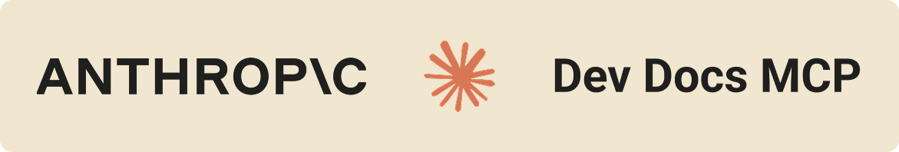

# Anthropic Docs MCP Server

A Model Context Protocol (MCP) server that provides comprehensive search and retrieval capabilities for Claude and Anthropic documentation, optimized for MCP development, APIs, examples, and templates.



## Features

- **Comprehensive Documentation Search**: Search through 100+ Claude documentation pages with intelligent relevance scoring
- **MCP Development Focus**: Optimized for MCP development, API integration, and tool building
- **Multi-Strategy Search**: Direct crawling, DuckDuckGo, and alternative search engines with fallbacks
- **Intelligent Relevance Scoring**: Results prioritized for MCP development, APIs, and examples
- **Fetch Documentation Content**: Retrieve and clean documentation pages with intelligent content extraction
- **IDE Integration**: Works seamlessly with Cursor and VS Code through MCP
- **Dual Transport Support**: Supports both stdio (for IDE integration) and HTTP (for web clients)

## Installation

Install the package globally from NPM:

```bash
npm install -g @julianoczkowski/anthropic-docs-mcp-ts
```

or

```bash
sudo npm install -g @julianoczkowski/anthropic-docs-mcp-ts
```

## IDE Integration

### Cursor Configuration

Add the following to your Cursor MCP configuration file (`~/.cursor/mcp.json`):

```json
{
  "mcpServers": {
    "anthropic-docs": {
      "command": "anthropic-docs-mcp",
      "args": ["--transport", "stdio"]
    }
  }
}
```

**To set up in Cursor:**

1. Open Cursor
2. Go to Settings → MCP → Add New MCP Server
3. Add the configuration above
4. Restart Cursor
5. The server should appear in your MCP tools list

### VS Code Configuration

For VS Code with MCP extension, add to your MCP configuration:

```json
{
  "servers": {
    "anthropic-docs": {
      "type": "stdio",
      "command": "anthropic-docs-mcp",
      "args": ["--transport", "stdio"]
    }
  }
}
```

**To set up in VS Code:**

1. Install the MCP extension for VS Code
2. Add the configuration above to your MCP settings
3. Restart VS Code
4. The tools should be available in the MCP tools panel

## Available Tools

### `search_anthropic_docs`

Search Claude and Anthropic documentation with intelligent relevance scoring optimized for MCP development, APIs, examples, and templates.

**Parameters:**

- `query` (string, required): Search query for Claude documentation
- `max_results` (number, optional): Maximum number of results to return (1-10, default: 5)

**Example:**

```json
{
  "query": "MCP server development",
  "max_results": 3
}
```

### `fetch_doc`

Fetch and clean a documentation page from a URL with intelligent content extraction.

**Parameters:**

- `url` (string, required): URL of the documentation page to fetch
- `max_chars` (number, optional): Maximum characters to return (500-20000, default: 4000)

**Example:**

```json
{
  "url": "https://docs.claude.com/en/docs/agents-and-tools/mcp-connector",
  "max_chars": 2000
}
```

## Search Optimization

This MCP server is specifically optimized for MCP development and provides intelligent search results:

### Priority Categories

1. **Core MCP Documentation** (Highest Priority)
2. **Claude Code MCP Integration**
3. **API Documentation**
4. **SDK and Development Tools**
5. **Tool Use and Examples**
6. **Prompt Engineering and Templates**
7. **Resources and Examples**
8. **Advanced Features**
9. **Security and Best Practices**
10. **Integration and Deployment**

### Relevance Scoring

- **MCP keywords** (+25 points): mcp, model context protocol, server, client, tool, api
- **Development keywords** (+15 points): sdk, python, typescript, javascript, example, template, guide, tutorial
- **API keywords** (+10 points): api, endpoint, request, response, authentication, key
- **URL path priority**: MCP docs get highest priority, followed by SDK and API documentation

## Usage Examples

Once configured in your IDE, you can use the tools in your conversations:

- **Search for MCP examples**: "search_anthropic_docs" with query "MCP server examples"
- **Get specific documentation**: "fetch_doc" with a specific docs.claude.com URL
- **Find API references**: "search_anthropic_docs" with query "Claude API authentication"

## Troubleshooting

### Common Issues

1. **Tools not appearing in IDE**:

   - Ensure the package is installed globally: `npm install -g @julianoczkowski/anthropic-docs-mcp-ts`
   - Check your MCP configuration file syntax
   - Restart your IDE after configuration changes

2. **Search returns no results**:

   - Check your internet connection
   - Try different search terms
   - The server uses multiple search strategies with fallbacks

3. **MCP connection issues**:
   - Verify the `anthropic-docs-mcp` command works in your terminal
   - Check that the configuration file path is correct
   - Restart your IDE to pick up configuration changes

### Testing Installation

Test that the package is installed correctly:

```bash
anthropic-docs-mcp --help
```

## License

MIT License - see LICENSE file for details.

## Support

For issues and questions:

1. Check the troubleshooting section above
2. Review the MCP documentation at docs.claude.com
3. Open an issue on the repository
